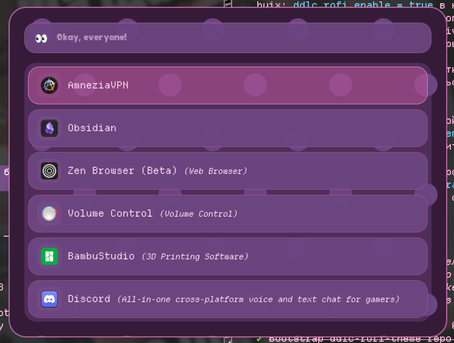
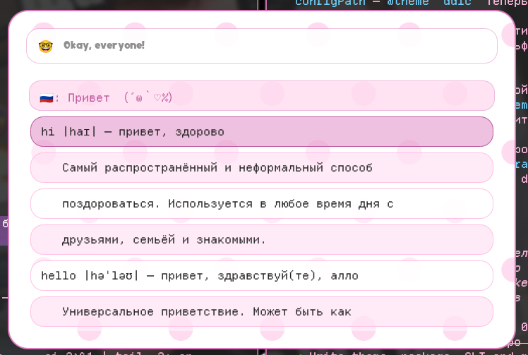

<div align="center">

# ddlc-rofi-theme

**The Doki Doki Literature Club rofi theme, light and dark** （´ω｀♡%）


[](https://github.com/rokokol/ddlc-palette)
[](LICENSE)
[](https://github.com/rokokol/ddlc-rofi-theme/actions/workflows/build.yml)

</div>

Rounded translucent rows on the game's own polka-dot background, in both a light and a dark variant, plus a simple switch between them

Every colour is a measured one out of [ddlc-palette](https://github.com/rokokol/ddlc-palette), which reads them off [ddlc.moe](https://ddlc.moe) — nothing here is eyeballed. The two variants share one layout and differ only in which palette keys fill it

Came over from my rice, **[rokokol/huix](https://github.com/rokokol/huix)**

```sh
# render it and look at the files, installing nothing
nix build github:rokokol/ddlc-rofi-theme && cat result/share/rofi/themes/ddlc-dark.rasi
```

## Contents

- [What it looks like](#what-it-looks-like)
- [Install](#install)
  - [Home Manager](#home-manager)
  - [Any other distribution](#any-other-distribution)
  - [The fonts are not in here](#the-fonts-are-not-in-here)
- [The switch](#the-switch)
- [How rofi finds it](#how-rofi-finds-it)
- [Tests](#tests)
- [Layout](#layout)

## What it looks like




> The rows here are [rofi-wooordhunt](https://github.com/rokokol/rofi-wooordhunt)

## Install

### Home Manager

```nix
{
  inputs.ddlc-rofi-theme.url = "github:rokokol/ddlc-rofi-theme";

  # in your home configuration
  imports = [ inputs.ddlc-rofi-theme.homeManagerModules.default ];

  ddlc.rofi.enable = true;
}
```

That deploys both variants, names the theme in your rofi config and picks one the first time — and never again, because which one is live is a runtime choice:

| option | what it does | default |
| --- | --- | --- |
| `name` | what the theme is called; `<name>.rasi` is what rofi resolves | `ddlc` |
| `default` | the variant the first activation picks | `light` |
| `width` | window width, in any unit rofi takes | `720px` |
| `font` | the font the window is set in | `programs.rofi.font` |
| `promptFont` | the font of the prompt alone, which is usually an emoji | `font` |
| `monoFont` | the font the rows and messages are set in | `monospace 12` |
| `placeholder` | what the empty search line says | `Okay, everyone!` |

### Any other distribution

```sh
git clone https://github.com/rokokol/ddlc-rofi-theme
cd ddlc-rofi-theme
sudo ./install.sh          # PREFIX=~/.local ./install.sh for a user install
```

Nothing is built: [`dist/`](dist) is the rendered theme, committed, so this is a copy into a directory rofi already searches. Then name it in `~/.config/rofi/config.rasi` and pick a variant:

Package recipes can stage the same layout without duplicating it: `DESTDIR="$pkgdir" PREFIX=/usr ./install.sh`

```conf
rofi.theme: ddlc
```

```sh
ddlc-rofi-theme light
```

### The fonts are not in here

The screenshots are set in **Doki**, the game's own face, and the rows in [DepartureMono](https://departuremono.com). Neither is shipped — a theme has no business installing fonts, and Doki is copyrighted besides. Out of the box the defaults are `sans-serif` and `monospace`; point `font` and `monoFont` at whatever you have

## The switch

`ddlc-rofi-theme light | dark | toggle | status` — one symlink, `~/.config/rofi/themes/<name>.rasi`, pointed at one of the two variants. rofi reads its theme on every launch, so there is nothing to reload: the next window is already the other variant. That is also why this is a command and not a daemon

Wire it into whatever already knows about light and dark — a GTK theme toggle, a sunrise timer, a key:

```conf
bind = SUPER, A, exec, ddlc-rofi-theme toggle
```

Where it looks for the variants, in order: next to the link, then `DDLC_ROFI_THEME_DIR`, then the `share/rofi/themes` of its own installation. Next to the link comes first for a reason — under Nix the packaged variant is a store path, and a symlink into one dangles after the next garbage collection, so the Home Manager module deploys copies into `~/.config` and the switch prefers those

| variable | what it sets |
| --- | --- |
| `DDLC_ROFI_THEME_NAME` | the theme's name, `ddlc` by default |
| `DDLC_ROFI_THEME_DIR` | where the variants live, when they are not next to the link |

## How rofi finds it

Two lookups, both rofi's own, and neither needs a path:

- `rofi.theme: ddlc` resolves against `${XDG_CONFIG_HOME}/rofi/themes/`, among others — that is what the symlink is doing there
- `background-image: url("ddlc-polka-light.svg")` is looked up in the **same flat directory**, not relative to the theme file that names it. So the two backgrounds have to be deployed next to the variants, and they carry the theme's name to keep out of another theme's way

## Tests

```sh
tests/run.sh   # the switch, against a throwaway config tree
```

`nix flake check` runs that plus: `dist/` is what the package would generate, both variants parse (`rofi -dump-theme` needs no display, and since rofi exits 0 on a theme it could not parse, the warning is the check), and the Home Manager module is evaluated against option stubs

A weekly workflow re-renders against the palette's HEAD rather than the lock and opens a pull request when they part ways, so a colour cannot move upstream and quietly leave this behind

## Layout

```
nix/theme.nix        the layout and the two colour sets, as one pure function
nix/                 package.nix, module.nix, module-test.nix
ddlc-rofi-theme.sh   the light/dark switch
dist/                the rendered theme, committed for consumers without Nix
tests/run.sh         the switch's suite
install.sh           for systems without Nix
```
